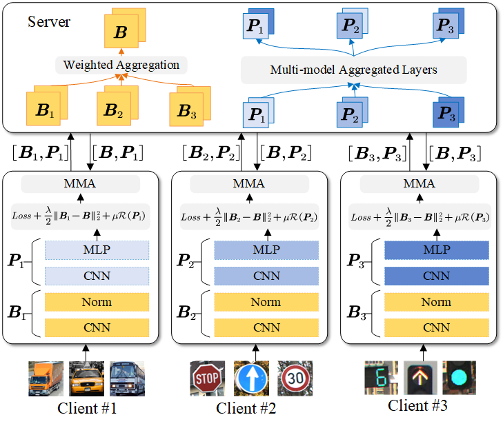

# uFedMBA: Unforgotten Presonalized Federated Learning with Memory Bank for Adaptively Aggregated Layers

## Paper Overview
Personalized federated learning (PFL) addresses the challenge of data heterogeneity across clients. However, existing efforts often struggle to balance model personalization and generalization under Non-IID data scenarios. This paper proposes uFedMBA, a novel PFL framework that decouples neural network parameters into global base-layer parameters and client-specific personalized-layer parameters. On the client side, uFedMBA adds a penalty term with base-layer parameters into the local loss function to prevent overfitting to local data and integrates the historical model into personalized-layer parameters for accelerating convergence. The server employs layer-wise aggregation based on gradient alignment to adaptively aggregate personalized layers, enhancing compatibility across heterogeneous clients. Extensive experiments demonstrate that the uFedMBA achieves state-of-the-art results on four image classification datasets. 

    

